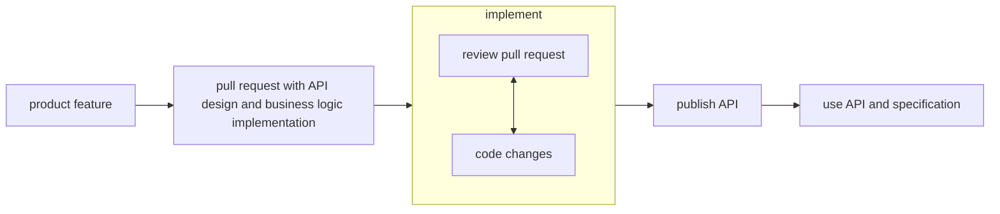
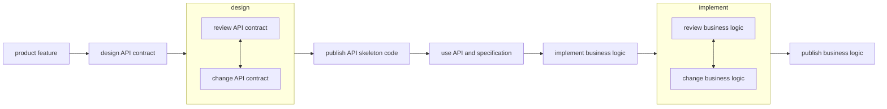

# OpenAPI-Demo

## What Is the Open API Specification

The [OpenAPI Specification](https://www.openapis.org/) (OAS) standardizes how to create an API design document. The typical workflow in an API-First approach using OAS is as follows:

    The team creates a design document and shares it with the involved people for feedback and iterative change.
    When the team and stakeholders agree on the API design, a developer uses the document to generate a server-side skeleton code using a document generator tool.
    Finally, the developer starts working on the API’s business logic using the previously generated code.

[OAS 3.1](https://spec.openapis.org/oas/v3.1.0) allows specifying HTTP resources, verbs, response codes, data models, media types, security schemes, and other API components.

## Why Use API-First Development

Agile Development is one of the most used methodologies in the software industry. Being agile means building something small as quickly as possible to either fail fast and change the initial design or move on with it, incrementally adding small changes.

From an Agile team perspective, API-First Development has a few advantages:

    Provides a way for fast feedback on the API design.
    Creates a single channel of communication toward an API contract agreement.
    Allows parallel work of the people involved in the API design.

To fully understand the advantages of an APi-first approach, we’ll compare two agile teams’ workflow scenarios. The first team uses the traditional approach, while the second uses API-First Development:

**Code-First API Developnent:**

**Design-First API Development:**

In a traditional scenario, a developer is assigned to build a new product feature. Typically, that developer creates the new feature by implementing the business logic first and then connecting that logic to an in-code API design. Thus, the API becomes available for the stakeholders to review only when the developer finishes all the code changes for that feature. Therefore, creating slowness and miscommunication about the API contract review and agreement.

In API-First Development, a designer creates the API contract document before the business logic development phase. That document provides a common language among the product stakeholders to evaluate the effort to build, provide timely feedback, create test use cases, document the API, etc. Thus, we can be more agile by either changing the initial design or moving on with it before wasting any time developing the application.

Another reason to use API-First Development is that multiple people can work in parallel on the same product feature after a document is created, for instance:

* Product managers evaluate risks, create new features, and manage time.
* QA analysts build their test scenarios.
* Technical writers document the API.
* Developers implement the business logic code.

## Create the API Specification

### Step 1 - Definiting the API Contract

|                         | HTTP verb | Resource       | Error RCs               | Success RCs                   |
|-------------------------|-----------|----------------|-------------------------|-------------------------------|
| get all workouts        | GET       | /workouts      | 404 - Account not found | 200 - Get workout overview    |
| create a new workout    | POST      | /workouts      | 404 - Account not found | 204 - Add workout completed   |
| get a specific workouts | GET       | /workouts/{id} | 404 - Account not found | 200 - Get workout information |

### Step 2 - Top-Level Context of the API

Let’s start by defining the top-level context of the API. To do that, go to the [Swagger Editor](https://editor.swagger.io/) and replace the content on the left side of the editor with the following YAML code:

    openapi: 3.0.3
    info:
      title: Health and Fitness API
      description: API for tracking workouts, nutrition, and health metrics.
      version: 1.0.0
    servers:
      - url: https://myfitnesstracker.ai/api/v1
        description: Demo
    tags:
      - name: fitness
        description: Workouts, nutrition and health metrics

Let’s check each keyword individually:

* openapi – The version of OAS used.
* title – Short title for the API.
* description – Description of the API responsibilities.
* version – The current version of the API, for instance, 1.0-SNAPSHOT.
* servers –  The available machines where the client can access the API.
* tags – A set of unique tags to group API operations in sub-sets.

### Step 3 - Exposing API Paths

Now, let’s create the API endpoints described earlier. To do that, add the following content at the root level of the YAML editor:

    paths:
      /workouts:
        get:
          summary: Get all workouts
          responses:
            '200':
              description: A list of workouts
              content:
                application/json:
                  schema:
                    type: array
                    items:
                      $ref: '#/components/schemas/Workout'
      
        post:
          summary: Create a new workout
          requestBody:
            required: true
            content:
              application/json:
                schema:
                  $ref: '#/components/schemas/Workout'
          responses:
            '201':
              description: Workout created successfully
              content:
                application/json:
                  schema:
                    $ref: '#/components/schemas/Workout'
                    
      /workouts/{id}:
        get:
          summary: Get a specific workout by ID
          parameters:
            - name: id
              in: path
              required: true
              description: ID of the workout
              schema:
                type: string
          responses:
            '200':
              description: A single workout
              content:
                application/json:
                  schema:
                    $ref: '#/components/schemas/Workout'
            '404':
              description: Workout not found

A lot is going on in the document above. Let’s break it down into parts by looking at each keyword individually:

* paths – Defines the API resources /workouts. Under the resources, we must define the get and post verbs available for them.
* summary – Brief information about what the endpoint does.
* description – More detailed information about how the endpoint works.
* operationId – A unique identifier of the operation described.
* requestBody – The request payload containing a description, content, and required keywords.
* responses – A list of all available response codes. Each response code object contains a description and content keywords.
* content - The HTTP Content-Type of the message.

### Step 4 - Defining the Data Model Components

Finally, let’s create the data model objects of our API: the request and response bodies and the error messages. To accomplish that, add the following structure at the root level of the YAML editor:

    components:
      schemas:
        Workout:
          type: object
          properties:
            id:
              type: string
              example: "123"
            type:
              type: string
              example: "Running"
            duration:
              type: integer
              example: 30
              description: Duration in minutes
            caloriesBurned:
              type: integer
              example: 300
            date:
              type: string
              format: date
              example: "2023-10-01"

After adding the content above, all the interpretation errors in the editor should have vanished.

In the above YAML code, we define the same components used in the schema keywords. We can reuse a component as much as we want. Let’s check the keywords in the code individually:

* components – The root level keyword of components.
* schemas – A list of all object definitions.
* type – The type of the field. If we use the object type, we must also define the properties keyword.
* properties – A list of all object field names and their types.

### Step 6 - Import to Spring Boot Application

This section shows how the developer can import the YAML document into the application and auto-generate the API skeleton code.

First, we must create an empty YAML file named account_api_description.yaml inside the /src/main/resources folder. Then, let’s replace the content of account_api_description.yaml with the complete YAML code in the Swagger online editor. Finally, we must add the openapi-generator-maven-plugin plugin to the <plugins> tag in the Spring Boot Application pom.xml file:

    <plugin>
        <groupId>org.openapitools</groupId>
        <artifactId>openapi-generator-maven-plugin</artifactId>
        <version>6.2.1</version>
        <executions>
            <execution>
                <goals>
                    <goal>generate</goal>
                </goals>
                <configuration>
                    <skipValidateSpec>true</skipValidateSpec>
                    <inputSpec>./src/main/java/com/example/resources/fitness_api_description.yaml</inputSpec>
                    <generatorName>spring</generatorName>
        <apiPackage>com.example.demo.api</apiPackage>
        <modelPackage>com.example.demo.model</modelPackage>
        <supportingFilesToGenerate>
            ApiUtil.java
        </supportingFilesToGenerate>
        <configOptions>
            <delegatePattern>true</delegatePattern>
              </configOptions>
                </configuration>
            </execution>
        </executions>
    </plugin>

We need to add the OpenAPI dependencies to generate the API classes:

    <dependency>
        <groupId>org.openapitools</groupId>
        <artifactId>jackson-databind-nullable</artifactId>
        <version>0.2.1</version>
    </dependency>
    <dependency>
        <groupId>org.springdoc</groupId>
        <artifactId>springdoc-openapi-ui</artifactId>
        <version>1.7.0</version>
    </dependency>

### Step 7 - Add OpenAPI and Swagger UI documentation

We can generate OpenAPI documentation:

    <dependency>
        <groupId>org.springdoc</groupId>
        <artifactId>springdoc-openapi-starter-webmvc-ui</artifactId>
        <version>2.8.5</version>
    </dependency>

Now, let’s generate the server-side code from the YAML file by running

    mvn clean install

After that, we can check the following generated code in the target folder:

### Step 8 - Trying it out

We can run our application and find the OpenAPI descriptions at 

    /v3/api-docs

We can also get the documentation as a yaml file by changing the path to /v3/api-docs.yaml.

The springdoc-openapi dependency already includes Swagger UI, so we’re all set to access the API documentation at:

    /swagger-ui/index.html

